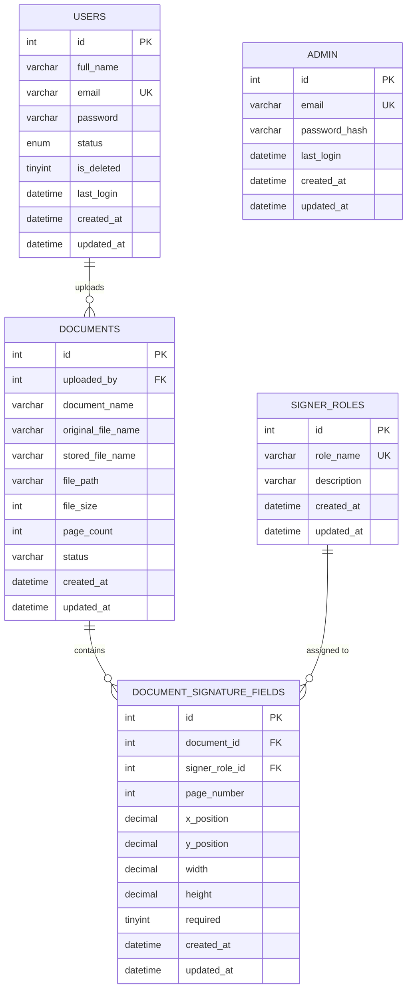

# eSign — Database Schema Documentation & Design

This document describes the MySQL schema backing the Electronic Signature
Document Management System: every table, column, constraint, index, and
relationship, plus the reasoning behind the design decisions. It was
originally reverse-engineered from the raw SQL in `src/services/*.ts` (no
migration file ships with the project) and has since been cross-checked
against an actual `mysqldump` of the live database — a few columns and
constraints below have been corrected to match what's really in the
database, since the code-derived guesses didn't all turn out to be right.
It's intended to double as the schema you'd hand in for the capstone's
"database schema documentation" deliverable.

---

## 1. Entity overview

Five tables, three of them forming the core signing workflow:

| Table | Purpose |
|---|---|
| `admin` | Platform administrators — manage user accounts |
| `users` | End users — upload and manage documents |
| `documents` | Uploaded PDFs and their metadata |
| `signer_roles` | Reusable signer types (Buyer, Seller, Approver, ...) |
| `document_signature_fields` | Where each signer role must sign, per document |

**Design note — Admin and User are separate tables, not one table with a
role column.** This was likely a deliberate choice (or at least how the
code was built): admins have no `full_name`, `status`, or document
ownership; users have no dashboard-level visibility. Splitting them avoids
a table full of nullable, role-conditional columns. The trade-off is some
duplication (both tables have `email`, a password column, `last_login`)
and two separate login/auth code paths instead of one — worth knowing if
you ever add a third role, since it won't fit cleanly into either table.

---

## 2. Entity-relationship diagram



`ADMIN` has no edges — it doesn't participate in the document/signature
graph at all; it only manages rows in `USERS`.

---

## 3. Table definitions

### 3.1 `admin`

Platform administrators. Managed independently of `users` — there is no
UI or endpoint for an admin to create another admin; seed this table
directly.

| Column | Type | Constraints | Notes |
|---|---|---|---|
| `id` | `INT` | `PK`, `AUTO_INCREMENT` | |
| `email` | `VARCHAR(255)` | `NOT NULL`, `UNIQUE` | Login identifier |
| `password_hash` | `VARCHAR(255)` | `NOT NULL` | bcrypt hash (cost factor 12, per `hashPassword`) |
| `last_login` | `DATETIME` | `NULL` | Updated on every successful login |
| `created_at` | `DATETIME` | `NOT NULL DEFAULT CURRENT_TIMESTAMP` | |
| `updated_at` | `DATETIME` | `NOT NULL DEFAULT CURRENT_TIMESTAMP ON UPDATE CURRENT_TIMESTAMP` | Present in the live table even though no current endpoint updates an admin row after creation |

No `full_name` — the admin profile endpoint only ever returns
`id`/`email`/`last_login`/`created_at`.

```sql
CREATE TABLE admin (
  id            INT AUTO_INCREMENT PRIMARY KEY,
  email         VARCHAR(255) NOT NULL UNIQUE,
  password_hash VARCHAR(255) NOT NULL,
  last_login    DATETIME NULL,
  created_at    DATETIME NOT NULL DEFAULT CURRENT_TIMESTAMP,
  updated_at    DATETIME NOT NULL DEFAULT CURRENT_TIMESTAMP ON UPDATE CURRENT_TIMESTAMP
);
```

---

### 3.2 `users`

End users — the accounts that upload documents and configure signature
fields. Created and managed exclusively by admins (there is no
self-registration endpoint).

| Column | Type | Constraints | Notes |
|---|---|---|---|
| `id` | `INT` | `PK`, `AUTO_INCREMENT` | |
| `full_name` | `VARCHAR(100)` | `NOT NULL` | |
| `email` | `VARCHAR(255)` | `NOT NULL`, `UNIQUE` | Login identifier; uniqueness enforced both by this constraint and an app-level check before insert/update |
| `password` | `VARCHAR(255)` | `NOT NULL` | bcrypt hash — column name is misleading (it's never stored in plaintext) |
| `status` | `ENUM('Active','Inactive')` | `NOT NULL DEFAULT 'Active'` | Set by admin; gates nothing else in the app currently (an inactive user can still log in — `status` isn't checked in the login query) |
| `is_deleted` | `TINYINT(1)` | `NOT NULL DEFAULT 0` | Referenced by the document-list query (`WHERE u.is_deleted = 0`) but never set by any endpoint — see §5 design notes |
| `last_login` | `DATETIME` | `NULL` | |
| `created_at` | `DATETIME` | `NOT NULL DEFAULT CURRENT_TIMESTAMP` | |
| `updated_at` | `DATETIME` | `NOT NULL DEFAULT CURRENT_TIMESTAMP ON UPDATE CURRENT_TIMESTAMP` | |

```sql
CREATE TABLE users (
  id          INT AUTO_INCREMENT PRIMARY KEY,
  full_name   VARCHAR(100) NOT NULL,
  email       VARCHAR(255) NOT NULL UNIQUE,
  password    VARCHAR(255) NOT NULL,
  status      ENUM('Active','Inactive') NOT NULL DEFAULT 'Active',
  is_deleted  TINYINT(1) NOT NULL DEFAULT 0,
  last_login  DATETIME NULL,
  created_at  DATETIME NOT NULL DEFAULT CURRENT_TIMESTAMP,
  updated_at  DATETIME NOT NULL DEFAULT CURRENT_TIMESTAMP ON UPDATE CURRENT_TIMESTAMP
  -- idx_users_search (full_name, email) is a recommendation, not yet
  -- present on the live table — see §6
);
```

---

### 3.3 `documents`

One row per uploaded PDF.

| Column | Type | Constraints | Notes |
|---|---|---|---|
| `id` | `INT` | `PK`, `AUTO_INCREMENT` | |
| `uploaded_by` | `INT` | `NOT NULL`, `FK → users.id` | The user who uploaded it |
| `document_name` | `VARCHAR(255)` | `NOT NULL` | User-facing display name, editable after upload |
| `original_file_name` | `VARCHAR(255)` | `NOT NULL` | Filename as uploaded by the client |
| `stored_file_name` | `VARCHAR(255)` | `NOT NULL` | Server-generated (`{timestamp}-{uuid}.pdf`) — the actual filename on disk, used to avoid collisions |
| `file_path` | `VARCHAR(500)` | `NOT NULL` | Relative path, e.g. `uploads/1699999999-<uuid>.pdf` |
| `file_size` | `BIGINT` | `NOT NULL` | Bytes — wider than `INT` so large PDFs/scans don't risk overflowing the ~2.1GB signed-`INT` ceiling |
| `page_count` | `INT` | `NOT NULL` | Computed at upload time via `pdf-lib` |
| `status` | `ENUM('Draft','In Progress','Completed','Archived')` | `DEFAULT 'Draft'` | Already enforced as an enum at the DB level, matching `DOCUMENT_STATUS` in the backend's `constants.ts` — the app-layer type and the DB constraint agree |
| `created_at` | `DATETIME` | `NOT NULL DEFAULT CURRENT_TIMESTAMP` | |
| `updated_at` | `DATETIME` | `NOT NULL DEFAULT CURRENT_TIMESTAMP ON UPDATE CURRENT_TIMESTAMP` | |

```sql
CREATE TABLE documents (
  id                 INT AUTO_INCREMENT PRIMARY KEY,
  uploaded_by        INT NOT NULL,
  document_name      VARCHAR(255) NOT NULL,
  original_file_name VARCHAR(255) NOT NULL,
  stored_file_name   VARCHAR(255) NOT NULL,
  file_path          VARCHAR(500) NOT NULL,
  file_size          BIGINT NOT NULL,
  page_count         INT NOT NULL,
  status             ENUM('Draft','In Progress','Completed','Archived') DEFAULT 'Draft',
  created_at         DATETIME NOT NULL DEFAULT CURRENT_TIMESTAMP,
  updated_at         DATETIME NOT NULL DEFAULT CURRENT_TIMESTAMP ON UPDATE CURRENT_TIMESTAMP,
  CONSTRAINT fk_documents_uploaded_by
    FOREIGN KEY (uploaded_by) REFERENCES users(id),
  INDEX idx_documents_uploaded_by (uploaded_by)
  -- idx_documents_status and idx_documents_created_at are recommendations,
  -- not yet present on the live table — see §6
);
```

`file_size` is `BIGINT`, not `INT` — large PDFs (or scans) can exceed the
~2.1GB signed-`INT` ceiling, so the live table already uses the wider type.

The foreign key on `uploaded_by` has no explicit `ON DELETE` clause, which
MySQL treats as `RESTRICT` by default — so the effect described below
holds, it's just implicit rather than spelled out in the DDL:
deleting a user who still has documents on file is blocked, so document
history/audit trail isn't silently orphaned. (The current
`AdminService.deleteUser` does a hard delete with no check for this —
under this constraint, that delete would fail at the DB level rather than
leaving `documents.uploaded_by` dangling. See §5.)

---

### 3.4 `signer_roles`

A flat, reusable lookup table of signer types. Not tied to any single
document — the same "Buyer" role can be dragged onto many different
documents.

| Column | Type | Constraints | Notes |
|---|---|---|---|
| `id` | `INT` | `PK`, `AUTO_INCREMENT` | |
| `role_name` | `VARCHAR(100)` | `NOT NULL`, `UNIQUE` | e.g. `buyer`, `seller`, `approver` |
| `description` | `VARCHAR(255)` | `NULL` | Optional, free text |
| `created_at` | `DATETIME` | `NOT NULL DEFAULT CURRENT_TIMESTAMP` | |
| `updated_at` | `DATETIME` | `NOT NULL DEFAULT CURRENT_TIMESTAMP ON UPDATE CURRENT_TIMESTAMP` | |

```sql
CREATE TABLE signer_roles (
  id          INT AUTO_INCREMENT PRIMARY KEY,
  role_name   VARCHAR(100) NOT NULL UNIQUE,
  description VARCHAR(255) NULL,
  created_at  DATETIME NOT NULL DEFAULT CURRENT_TIMESTAMP,
  updated_at  DATETIME NOT NULL DEFAULT CURRENT_TIMESTAMP ON UPDATE CURRENT_TIMESTAMP
);
```

**Note:** `role_name` already carries a `UNIQUE` constraint at the DB
level — two roles named `"buyer"` are rejected at the database layer even
if `SignerRoleService.createSignerRole` doesn't check for this itself
before inserting. Worth catching the resulting duplicate-key error in the
service layer and turning it into a friendly 409, rather than letting a
raw DB error surface to the client.

---

### 3.5 `document_signature_fields`

The join entity between a document and a signer role — one row per
signature box placed on a PDF page. This is the table that gets **fully
replaced** (delete-all, then bulk-insert) every time `PUT
/document/documents/:id/signature-fields` is called.

| Column | Type | Constraints | Notes |
|---|---|---|---|
| `id` | `INT` | `PK`, `AUTO_INCREMENT` | |
| `document_id` | `INT` | `NOT NULL`, `FK → documents.id` | |
| `signer_role_id` | `INT` | `NOT NULL`, `FK → signer_roles.id` | |
| `page_number` | `INT` | `NOT NULL` | 1-indexed |
| `x_position` | `DECIMAL(10,2)` | `NOT NULL` | Pixel/point offset from page left edge |
| `y_position` | `DECIMAL(10,2)` | `NOT NULL` | Offset from page top edge |
| `width` | `DECIMAL(10,2)` | `DEFAULT 180.00` | Nullable with a default in the live table, not `NOT NULL` — a field created without an explicit width falls back to 180 |
| `height` | `DECIMAL(10,2)` | `DEFAULT 60.00` | Nullable with a default in the live table, not `NOT NULL` — falls back to 60 |
| `required` | `TINYINT(1)` | `DEFAULT 1` | Whether the field must be completed |
| `created_at` | `DATETIME` | `NOT NULL DEFAULT CURRENT_TIMESTAMP` | |
| `updated_at` | `DATETIME` | `NOT NULL DEFAULT CURRENT_TIMESTAMP ON UPDATE CURRENT_TIMESTAMP` | |

```sql
CREATE TABLE document_signature_fields (
  id             INT AUTO_INCREMENT PRIMARY KEY,
  document_id    INT NOT NULL,
  signer_role_id INT NOT NULL,
  page_number    INT NOT NULL,
  x_position     DECIMAL(10,2) NOT NULL,
  y_position     DECIMAL(10,2) NOT NULL,
  width          DECIMAL(10,2) DEFAULT 180.00,
  height         DECIMAL(10,2) DEFAULT 60.00,
  required       TINYINT(1) DEFAULT 1,
  created_at     DATETIME NOT NULL DEFAULT CURRENT_TIMESTAMP,
  updated_at     DATETIME NOT NULL DEFAULT CURRENT_TIMESTAMP ON UPDATE CURRENT_TIMESTAMP,
  CONSTRAINT fk_dsf_document
    FOREIGN KEY (document_id) REFERENCES documents(id)
    ON DELETE CASCADE,
  CONSTRAINT fk_dsf_signer_role
    FOREIGN KEY (signer_role_id) REFERENCES signer_roles(id),
  INDEX idx_dsf_document_id (document_id),
  INDEX idx_dsf_signer_role_id (signer_role_id)
);
```

As with `documents.uploaded_by`, the `signer_role_id` foreign key has no
explicit `ON DELETE` clause in the live table, which defaults to
`RESTRICT` — same effect as written below, just implicit.

- `ON DELETE CASCADE` on `document_id`: deleting a document cleans up its
  signature fields automatically — matches `DocumentService.deleteDocument`,
  which deletes the document row directly without first clearing its
  fields.
- `ON DELETE RESTRICT` on `signer_role_id`: stops a signer role from being
  deleted while it's still placed on a document, so existing signature
  boxes never point at a role that no longer exists. (Today,
  `SignerRoleService.deleteSignerRole` has no application-level check for
  this — under this constraint the DB itself would reject the delete with
  a foreign-key error, which the current error handler surfaces as a
  generic 500 rather than a friendly "role is in use" message. Worth
  adding that check in the service layer.)

---

## 4. Relationships summary

| Relationship | Cardinality | Enforced by |
|---|---|---|
| A user uploads many documents | 1 : N | `documents.uploaded_by → users.id` |
| A document has many signature fields | 1 : N | `document_signature_fields.document_id → documents.id`, cascade delete |
| A signer role is used by many signature fields | 1 : N | `document_signature_fields.signer_role_id → signer_roles.id` |
| A document has many signer roles (through fields) | M : N | Realized via `document_signature_fields` as the join table — a document can have fields for Buyer, Seller, and Approver simultaneously, and each of those roles is reused across other documents too |
| Admin ↔ everything else | none | `admin` is fully isolated; it manages `users` only through the application layer, not a foreign key |

In plain English: **documents and signer roles have a many-to-many
relationship, resolved through `document_signature_fields`**, which also
carries the position/size/required attributes specific to *that*
placement of *that* role on *that* document — i.e. it's an associative
entity with its own attributes, not a plain join table.

---

## 5. Design notes, trade-offs, and recommendations

These reflect gaps between what the current code assumes and what the
schema actually enforces — useful if you're asked to justify or extend
the design. (Corrected against a live `mysqldump`: the two points that
used to be listed here as gaps — `documents.status` and
`signer_roles.role_name` — turned out to already be handled at the DB
level, so they've been removed from this list and folded into §3 instead.)

- **`users.is_deleted` is read but never written.** The document list
  query filters `WHERE u.is_deleted = 0`, implying a soft-delete pattern
  was planned for users, but `AdminService.deleteUser` does a hard
  `DELETE`. Either finish the soft-delete (have `deleteUser` set the flag
  instead of removing the row, so document history survives a user
  deletion) or drop the column and the filter.
- **Foreign keys are already present and confirmed** in the live
  database — `documents.uploaded_by → users.id`,
  `document_signature_fields.document_id → documents.id` (cascade
  delete), and `document_signature_fields.signer_role_id →
  signer_roles.id` all exist as real `CONSTRAINT`s, not just as an
  application-level convention. Referential integrity is enforced at
  the DB layer in addition to whatever checks the service code does
  (e.g. checking `documents.length === 0` before inserting a signature
  field).
- **`document_signature_fields` has no `UNIQUE` constraint preventing two
  identical placements** (same document, role, page, and position) — the
  application doesn't dedupe on save, so overlapping/duplicate fields are
  possible if a client sends them.
- **Passwords**: both `admin.password_hash` and `users.password` store
  bcrypt hashes (cost factor 12). The `users.password` column name is a
  slight misnomer worth renaming to `password_hash` for clarity/consistency
  with the admin table, though it doesn't affect behavior.

---

## 6. Indexing rationale

**Actually present on the live database:**

| Index | Table | Why |
|---|---|---|
| `UNIQUE (email)` | `admin`, `users` | Login lookups are always by email; also enforces the app's one-account-per-email rule at the DB layer, not just in application code |
| `UNIQUE (role_name)` | `signer_roles` | Prevents duplicate role names at the DB layer |
| `idx_documents_uploaded_by` (on `uploaded_by`) | `documents` | Speeds up the `JOIN` against `users` in the document list query, and any future "my documents" filter |
| `idx_dsf_document_id` | `document_signature_fields` | Every field lookup and the full-replace delete are scoped by `document_id` |
| `idx_dsf_signer_role_id` | `document_signature_fields` | Supports the `JOIN` back to `signer_roles` when loading fields |

**Recommended but not yet present** (see §7.1 for the `ALTER TABLE`
statements):

| Index | Table | Why |
|---|---|---|
| `idx_users_search (full_name, email)` | `users` | Admin's user list supports `LIKE` search across both columns |
| `idx_documents_status` | `documents` | Document list supports filtering by status |
| `idx_documents_created_at` | `documents` | List is always sorted `ORDER BY created_at DESC` |

`full_name`/`email`/`document_name` search in this codebase uses
`LIKE '%term%'` (leading wildcard), which **cannot use a standard B-tree
index for the search itself** — the indexes above still help the `JOIN`
and `ORDER BY` portions of those queries, but if search performance
becomes a bottleneck at scale, a `FULLTEXT` index (MySQL) or a dedicated
search engine would be the next step, not a bigger B-tree index.

---

## 7. Full consolidated schema (copy-paste ready)

This matches the live database exactly (verified against a `mysqldump` of
the actual schema) — not a set of recommendations. Run these in order
(each table depends on the ones above it).

```sql
CREATE TABLE admin (
  id            INT AUTO_INCREMENT PRIMARY KEY,
  email         VARCHAR(255) NOT NULL UNIQUE,
  password_hash VARCHAR(255) NOT NULL,
  last_login    DATETIME NULL,
  created_at    DATETIME NOT NULL DEFAULT CURRENT_TIMESTAMP,
  updated_at    DATETIME NOT NULL DEFAULT CURRENT_TIMESTAMP ON UPDATE CURRENT_TIMESTAMP
);

CREATE TABLE users (
  id          INT AUTO_INCREMENT PRIMARY KEY,
  full_name   VARCHAR(100) NOT NULL,
  email       VARCHAR(255) NOT NULL UNIQUE,
  password    VARCHAR(255) NOT NULL,
  status      ENUM('Active','Inactive') DEFAULT 'Active',
  last_login  DATETIME NULL,
  created_at  DATETIME NOT NULL DEFAULT CURRENT_TIMESTAMP,
  updated_at  DATETIME NOT NULL DEFAULT CURRENT_TIMESTAMP ON UPDATE CURRENT_TIMESTAMP,
  is_deleted  TINYINT DEFAULT 0
);

CREATE TABLE signer_roles (
  id          INT AUTO_INCREMENT PRIMARY KEY,
  role_name   VARCHAR(100) NOT NULL UNIQUE,
  description VARCHAR(255) NULL,
  created_at  DATETIME NOT NULL DEFAULT CURRENT_TIMESTAMP,
  updated_at  DATETIME NOT NULL DEFAULT CURRENT_TIMESTAMP ON UPDATE CURRENT_TIMESTAMP
);

CREATE TABLE documents (
  id                 INT AUTO_INCREMENT PRIMARY KEY,
  document_name      VARCHAR(255) NOT NULL,
  original_file_name VARCHAR(255) NOT NULL,
  stored_file_name   VARCHAR(255) NOT NULL,
  file_path          VARCHAR(500) NOT NULL,
  file_size          BIGINT NOT NULL,
  page_count         INT NOT NULL,
  status             ENUM('Draft','In Progress','Completed','Archived') DEFAULT 'Draft',
  uploaded_by        INT NOT NULL,
  created_at         DATETIME NOT NULL DEFAULT CURRENT_TIMESTAMP,
  updated_at         DATETIME NOT NULL DEFAULT CURRENT_TIMESTAMP ON UPDATE CURRENT_TIMESTAMP,
  CONSTRAINT fk_documents_uploaded_by
    FOREIGN KEY (uploaded_by) REFERENCES users(id),
  INDEX idx_documents_uploaded_by (uploaded_by)
);

CREATE TABLE document_signature_fields (
  id             INT AUTO_INCREMENT PRIMARY KEY,
  document_id    INT NOT NULL,
  signer_role_id INT NOT NULL,
  page_number    INT NOT NULL,
  x_position     DECIMAL(10,2) NOT NULL,
  y_position     DECIMAL(10,2) NOT NULL,
  width          DECIMAL(10,2) DEFAULT 180.00,
  height         DECIMAL(10,2) DEFAULT 60.00,
  required       TINYINT(1) DEFAULT 1,
  created_at     DATETIME NOT NULL DEFAULT CURRENT_TIMESTAMP,
  updated_at     DATETIME NOT NULL DEFAULT CURRENT_TIMESTAMP ON UPDATE CURRENT_TIMESTAMP,
  CONSTRAINT fk_dsf_document
    FOREIGN KEY (document_id) REFERENCES documents(id)
    ON DELETE CASCADE,
  CONSTRAINT fk_dsf_signer_role
    FOREIGN KEY (signer_role_id) REFERENCES signer_roles(id),
  INDEX idx_dsf_document_id (document_id),
  INDEX idx_dsf_signer_role_id (signer_role_id)
);
```

If you're retrofitting this onto an existing database that already has
data, add any further constraints with `ALTER TABLE ... ADD CONSTRAINT
...` after cleaning up any orphaned rows first (an `uploaded_by` pointing
at a deleted user, a `signer_role_id` with no matching row, etc.) — the
`ADD CONSTRAINT` will fail otherwise.

### 7.1 Recommended additions (not yet in the live schema)

These are genuinely absent from the live database — not just missing
from this doc — and are worth adding if you want to harden the schema
further before submitting or deploying:

```sql
ALTER TABLE users
  ADD INDEX idx_users_search (full_name, email);

ALTER TABLE documents
  ADD INDEX idx_documents_status (status),
  ADD INDEX idx_documents_created_at (created_at);
```

---

## 8. Sample data (for local testing)

```sql
INSERT INTO admin (email, password_hash) VALUES
  ('admin@example.com', '$2b$12$replace-with-a-real-bcrypt-hash');

INSERT INTO users (full_name, email, password, status) VALUES
  ('Priyanshu Patel', 'priyanshu@example.com', '$2b$12$replace-with-a-real-bcrypt-hash', 'Active');

INSERT INTO signer_roles (role_name, description) VALUES
  ('buyer', 'Purchases the goods or services'),
  ('seller', 'Provides the goods or services'),
  ('approver', 'Signs off before the document is finalized'),
  ('witness', 'Confirms the signing took place');

INSERT INTO documents
  (uploaded_by, document_name, original_file_name, stored_file_name, file_path, file_size, page_count, status)
VALUES
  (1, 'Vendor Services Agreement', 'Vendor_Agreement.pdf', '1786271289121-uuid.pdf',
   'uploads/1786271289121-uuid.pdf', 482113, 4, 'Draft');

INSERT INTO document_signature_fields
  (document_id, signer_role_id, page_number, x_position, y_position, width, height, required)
VALUES
  (1, 1, 1, 210.00, 340.00, 180.00, 60.00, 1),
  (1, 2, 2, 420.00, 510.00, 180.00, 60.00, 1);
```

Don't insert real bcrypt hashes by hand for anything beyond local testing
— use the app's own signup/create-user flow so `bcrypt.hash` runs with the
correct cost factor.